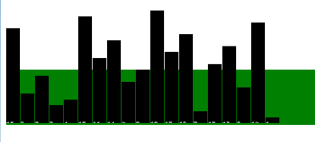
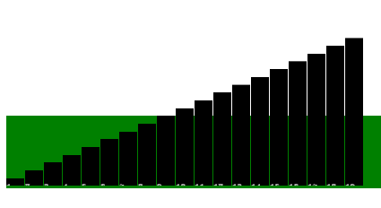

# 삽입 정렬




## 알게된점

```javascript
const sort = async() => {
    await 비동기처리
}
// 를 하는경우

const 비동기처리 = () =>
  new Promise((resolve) => {
    // 처리할 내용
    setTimeout(resolve, 얼마나 시간이 걸리게 할 지);
  });

// 를 주어 일정시간 뒤 실행하게 할 수 있다.


```
